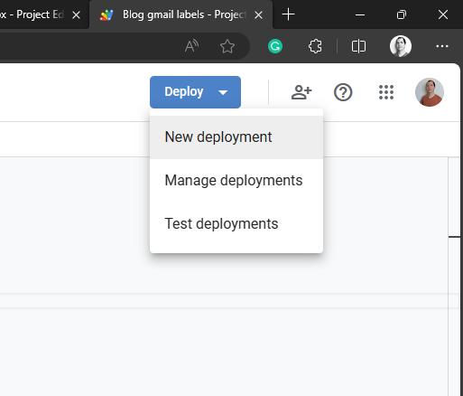
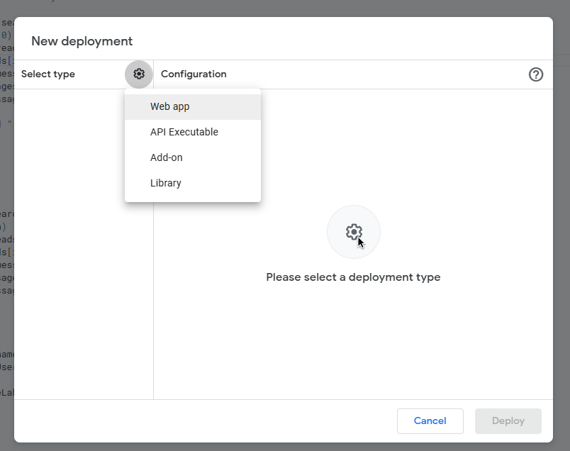
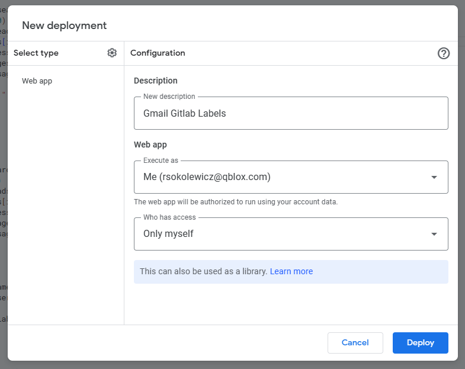
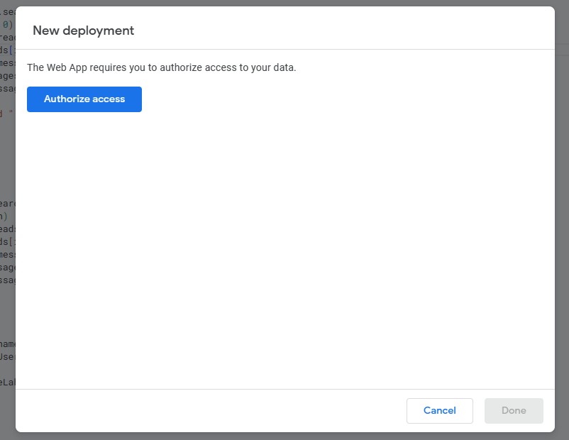
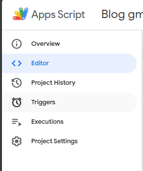
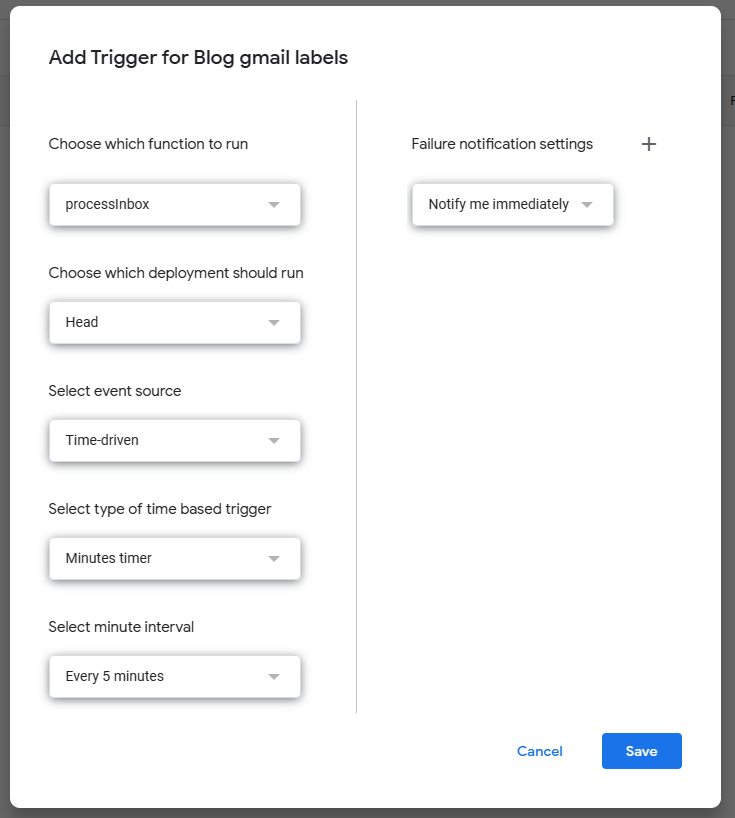

+++
title = "Google Scripts to label GitLab related emails"
date = "2023-09-27"
author= "Robert"
description = "How to use email headers to filter and label email notifications from GitLab."
draft = false
+++



If you are subscribed to many GitLab notifications, you might receive a lot of emails from GitLab for every merge request, issue, mention, review requested, and so on. Automatically labeling them in Gmail can be done by creating filters, but can be a bit difficult because you can only filter on titles and text body. A lot of useful information is actually present inside the email-headers, and for each notification GitLab adds GitLab-specific headers. For example which project it belongs to or if it's related to an issue or merge-request. 

What is nice about this is that it is straightforward to create a script that assigns a label to an email based on which GitLab-specific header it has. 

## Google Script

In short:

1. go to script.google.com
2. switch account if needed
3. New project
4. Add script that you want to run
5. hit deploy and new deployment 
6. select type: Web app 
7. add details 
8. authorize 
9. go to trigger 
10. add details 

## The Script

The script is written in JavaScript and makes use of some Google magic. 

```javascript

function searchAllEmails() {
  var start = 0;
  var max = 100;
  while (true) {
    var threads = GmailApp.search('', start, max);
    if (threads.length === 0) break;
    for (var i = 0; i < threads.length; i++) {
      var messages = threads[i].getMessages();
      for (var j = 0; j < messages.length; j++) {
        var message = messages[j];
        processMessage(message);
      }
      Logger.log("processed " + (start + i) + "/" + (start + max));
    }
    start += max;
  }
}

function processInbox() {
  var threads = GmailApp.search("label:unprocessed");
  var unprocessedLabel = GmailApp.getUserLabelByName('unprocessed');

  if (threads.length === 0) {
    return null;
  }
  for (var i = 0; i < threads.length; i++) {
    var messages = threads[i].getMessages();
    for (var j = 0; j < messages.length; j++) {
      var message = messages[j];
      processMessage(message);
    }
    threads[i].removeLabel(unprocessedLabel);
  }
}

function getOrCreateLabel(name) {
  var label = GmailApp.getUserLabelByName(name);
  if (!label) {
    label = GmailApp.createLabel(name);
  }
  return label;
}

function processMessage(message) {
  // see https://docs.gitlab.com/ee/user/profile/notifications.html#email-headers-you-can-use-to-filter-email
  // for more options.

  var issueLabel = getOrCreateLabel("Issue");
  var mrLabel = getOrCreateLabel("Merge request");
  var buildLabel = getOrCreateLabel("Build");
  var notificationLabel = getOrCreateLabel("Notification");
  var schedulerLabel = getOrCreateLabel("quantify-scheduler");
  var coreLabel = getOrCreateLabel("quantify-core");
  var mergedLabel = getOrCreateLabel("merged");
  var reviewLabel = getOrCreateLabel("review-me");

  if (message.getHeader("X-GitLab-Issue-ID")) {
    message.getThread().addLabel(issueLabel);
  }
  if (message.getHeader("X-GitLab-MergeRequest-ID")) {
    message.getThread().addLabel(mrLabel);
  }
  if (message.getHeader("X-GitLab-Author")) {
    message.getThread().addLabel(commitLabel);
  }
  if (message.getHeader("X-GitLab-Pipeline-Id")) {
    message.getThread().addLabel(buildLabel);
  }
  if (message.getHeader("X-GitLab-Project") == "quantify-scheduler") {
    message.getThread().addLabel(schedulerLabel);
  }
  if (message.getHeader("X-GitLab-Project") == "quantify-core") {
    message.getThread().addLabel(coreLabel);
  }
  var value = message.getHeader("X-GitLab-NotificationReason");
  if (value) {
    if (value == "review_requested") {
      var label = reviewLabel;
    } else {
      var label = notificationLabel;
    }
    message.getThread().addLabel(label);
  }
  if (message.getHeader("X-GitLab-MergeRequest-State") == "merged") {
    message.getThread().addLabel(mergedLabel);
  }
}
```

The `searchAllEmails` can be executed once to process your entire inbox, or if it takes too long cancel when you are satisfied. The function that gets executed every 5 minutes is `processInbox` which looks at each email thread and each email inside that thread for threads that were updated in the last ten minutes. The code should be self-explanatory, but essentially:

1. get email threads via `GmailApp.search("...")`
2. for each thread get email `threads[i].getMessages()`
3. for each email get the header `message.getHeader(...)`
4. if the header matches something GitLab specific, add label via `message.getThread().addLabel` and if it doesn't exist, create that label with `GmailApp.createLabel(name)`.

In the free version of Google Scripts, there is a usage limit that I kept running into (API calls to `GmailApp` and a max daily run time-limit of 90 minutes), so I added a condition in the code that only processes emails with the `unprocessed` label, and then remove it once done. To get new emails labelled as `unprocessed` the easiest is to create a filter inside Gmail itself that will label any email that comes into your inbox. The script will then process and remove the label within 5 minutes.

There are a few more headers and options that might be useful for you as listed in https://docs.gitlab.com/ee/user/profile/notifications.html#email-headers-you-can-use-to-filter-email. 