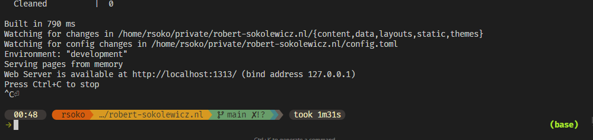

+++
title = "Supercharging your terminal with fish and starship"
date = "2024-09-15"
author = "Robert"
cover = ""
description = "Some cool enhancements to your terminal"
draft = false
+++

# A modern looking terminal



This is how my terminal looks like at the moment. The layout uses [starship](https://starship.rs/) to provide useful information about the shell at all times. For example, it shows the current python version if you are in a python environment, and the current branch if you are in a git repository. I made some minor modifications to the default layout, e.g. adding the time information to the right. I would still like to add a few more things, but I'm happy the way it is. 

Here's my starship config (`~/.config/starship.toml`):

```bash
"$schema" = 'https://starship.rs/config-schema.json'

format = """
[](fg:color_bg1)\
$time\
[ ](fg:color_bg1)\
[](color_orange)\
$username\
[](bg:color_yellow fg:color_orange)\
$directory\
[](fg:color_yellow bg:color_aqua)\
$git_branch\
$git_status\
[](fg:color_aqua bg:color_blue)\
$c\
$rust\
$golang\
$nodejs\
$php\
$java\
$kotlin\
$haskell\
$python\
[](fg:color_blue bg:color_bg3)\
$docker_context\
$conda\
[](fg:color_bg3)\
$cmd_duration\
$line_break$character"""

palette = 'gruvbox_dark'

[palettes.gruvbox_dark]
color_fg0 = '#fbf1c7'
color_bg1 = '#3c3836'
color_bg3 = '#665c54'
color_blue = '#458588'
color_aqua = '#689d6a'
color_green = '#98971a'
color_orange = '#d65d0e'
color_purple = '#b16286'
color_red = '#cc241d'
color_yellow = '#d79921'

[os]
disabled = false
style = "bg:color_orange fg:color_fg0"

[os.symbols]
Windows = "󰍲"
Ubuntu = "󰕈"
SUSE = ""
Raspbian = "󰐿"
Mint = "󰣭"
Macos = "󰀵"
Manjaro = ""
Linux = "󰌽"
Gentoo = "󰣨"
Fedora = "󰣛"
Alpine = ""
Amazon = ""
Android = ""
Arch = "󰣇"
Artix = "󰣇"
CentOS = ""
Debian = "󰣚"
Redhat = "󱄛"
RedHatEnterprise = "󱄛"

[username]
show_always = true
style_user = "bg:color_orange fg:color_fg0"
style_root = "bg:color_orange fg:color_fg0"
format = '[ $user ]($style)'

[directory]
style = "fg:color_fg0 bg:color_yellow"
format = "[ $path ]($style)"
truncation_length = 3
truncation_symbol = "…/"

[directory.substitutions]
"Documents" = "󰈙 "
"Downloads" = " "
"Music" = "󰝚 "
"Pictures" = " "
"Developer" = "󰲋 "

[git_branch]
symbol = ""
style = "bg:color_aqua"
format = '[[ $symbol $branch ](fg:color_fg0 bg:color_aqua)]($style)'

[git_status]
style = "bg:color_aqua"
format = '[[($all_status$ahead_behind )](fg:color_fg0 bg:color_aqua)]($style)'

[nodejs]
symbol = ""
style = "bg:color_blue"
format = '[[ $symbol( $version) ](fg:color_fg0 bg:color_blue)]($style)'

[c]
symbol = " "
style = "bg:color_blue"
format = '[[ $symbol( $version) ](fg:color_fg0 bg:color_blue)]($style)'

[rust]
symbol = ""
style = "bg:color_blue"
format = '[[ $symbol( $version) ](fg:color_fg0 bg:color_blue)]($style)'

[golang]
symbol = ""
style = "bg:color_blue"
format = '[[ $symbol( $version) ](fg:color_fg0 bg:color_blue)]($style)'

[php]
symbol = ""
style = "bg:color_blue"
format = '[[ $symbol( $version) ](fg:color_fg0 bg:color_blue)]($style)'

[java]
symbol = " "
style = "bg:color_blue"
format = '[[ $symbol( $version) ](fg:color_fg0 bg:color_blue)]($style)'

[kotlin]
symbol = ""
style = "bg:color_blue"
format = '[[ $symbol( $version) ](fg:color_fg0 bg:color_blue)]($style)'

[haskell]
symbol = ""
style = "bg:color_blue"
format = '[[ $symbol( $version) ](fg:color_fg0 bg:color_blue)]($style)'

[python]
symbol = ""
style = "bg:color_blue"
format = '[[ $symbol( $version) ](fg:color_fg0 bg:color_blue)]($style)'

[docker_context]
symbol = ""
style = "bg:color_bg3"
format = '[[ $symbol( $context) ](fg:#83a598 bg:color_bg3)]($style)'

[conda]
style = "bg:color_bg3"
ignore_base = false
format = '[[ $symbol( $environment) ](fg:#83a598 bg:color_bg3)]($style)'

[cmd_duration]
min_time = 1000
show_milliseconds = false
style = "bg:color_bg3 fg:#ffffff"
show_notifications = false
format = '[[ ](fg:color_bg1)[took $duration](fg:color_fg0 bg:color_bg1)]($style)[ ](fg:color_bg1)'

[time]
disabled = false
time_format = "%R"
style = "bg:color_bg1"
format = '[[ $time ](fg:color_fg0 bg:color_bg1)]($style)'

[line_break]
disabled = false

[character]
disabled = false
success_symbol = '[](bold fg:color_green)'
error_symbol = '[](bold fg:color_red)'
vimcmd_symbol = '[](bold fg:color_green)'
vimcmd_replace_one_symbol = '[](bold fg:color_purple)'
vimcmd_replace_symbol = '[](bold fg:color_purple)'
vimcmd_visual_symbol = '[](bold fg:color_yellow)'
```

(You'll need a [nerd font](https://www.nerdfonts.com/) with glyphs to see all the fancy characters)

# Fish shell

I've been using [fish](https://fishshell.com/) for almost a year now, and I really like it. I use it mostly for the auto-complete feature. It's almost as smart as an AI copilot in your editor, but now in the terminal. (note: it's a very simple frequency based autocomplete, no AI whatsoever)

Here's my fish config (`~/.config/fish/config.fish`):

```bash
# Fish syntax highlighting
set -g fish_color_autosuggestion '555'  'brblack'
set -g fish_color_cancel -r
set -g fish_color_command --bold
set -g fish_color_comment red
set -g fish_color_cwd green
set -g fish_color_cwd_root red
set -g fish_color_end brmagenta
set -g fish_color_error brred
set -g fish_color_escape 'bryellow'  '--bold'
set -g fish_color_history_current --bold
set -g fish_color_host normal
set -g fish_color_match --background=brblue
set -g fish_color_normal normal
set -g fish_color_operator bryellow
set -g fish_color_param cyan
set -g fish_color_quote yellow
set -g fish_color_redirection brblue
set -g fish_color_search_match 'bryellow'  '--background=brblack'
set -g fish_color_selection 'white'  '--bold'  '--background=brblack'
set -g fish_color_user brgreen
set -g fish_color_valid_path --underline

# Install Starship
starship init fish | source

set -x PATH $PATH /home/rsoko/flutter/bin

# >>> conda initialize >>>
# !! Contents within this block are managed by 'conda init' !!
eval /home/rsoko/.anaconda3/bin/conda "shell.fish" "hook" $argv | source
set -e CONDA_DEFAULT_ENV # disable showing environment name. This is done by starship

# <<< conda initialize <<<

function edge
    set path $argv[1]
    set winpath (wslpath -w $path)
    "/mnt/c/Program Files (x86)/Microsoft/Edge/Application/msedge.exe" "file://$winpath" &
end

function check_and_activate_conda
    set current_path (pwd)
    set qblox_path ~/qblox

    if test -e ".condaenv"
        set env_name (cat .condaenv | string trim)
        if test -n "$env_name"
            if not string match -q -- "*$env_name*" $CONDA_DEFAULT_ENV
                conda activate $env_name
            end
        end
    else if string match -q "$qblox_path*" $current_path
        if test "$CONDA_DEFAULT_ENV" = "base" -o -z "$CONDA_DEFAULT_ENV"
            conda activate dev
        end
    end
end

function auto_activate_conda --on-variable PWD
    check_and_activate_conda
end

# Run check_and_activate_conda on shell init
if status is-interactive
    check_and_activate_conda
end

# API Keys
set -x OPENAI_API_KEY "sk-proj-..."
set -x ANTHROPIC_API_KEY "sk-ant-..."
```

