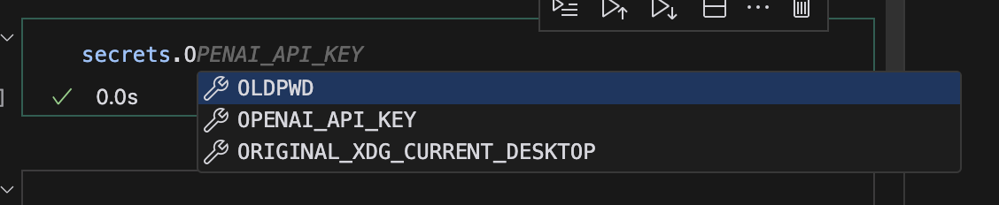

+++
title = "Keeping secrets secret"
date = "2024-12-28"
author = "Robert"
cover = ""
description = "Some tips on how to manage secrets and prevent leaking them."
draft = false
+++



## Managing secrets with `python-dotenv` 

Now that I'm working more often with third party APIs, I need to manage and store API keys. Normally I would add them to my `.bashrc` or similar, but this is becoming cumbersome when you have for example different OpenAI keys for different projects. It's much nicer to save them inside each project and use something like `python-dotenv` to load them into the environment.

A `.env` file could look like this:

```yaml
OPENAI_API_KEY=sk-proj-zGoKFui76yo-kwqXx_...
GOOGLE_CLOUD_CREDENTIALS=...
```

and then the following will load the variables into your environment:

```python
from dotenv import load_dotenv

load_dotenv()
```

and if you want to override an existing environmental variable, you can do so by setting the `override=True` flag:

```python
load_dotenv(override=True)
```

The exact format is not important, so all of the following is equivalent:

```python
OPENAI_API_KEY=sk-...
OPENAI_API_KEY = sk-...
OPENAI_API_KEY="sk-..."
OPENAI_API_KEY sk-...
OPENAI_API_KEY "sk-..."
...
```

## Managing secrets with `streamlit`

When using streamlit, you can instead use `st.secrets` to load secrets from the `.streamlit/secrets.toml` file. This is a bit more secure than using `st.secrets` as it's not stored in the `.streamlit` folder, but instead in the `.streamlit/secrets.toml` file.

One benefit over using `python-dotenv` is that you can grab a collection of secrets in a json format. This is useful when using Google Cloud credentials:

```toml
# .streamlit/secrets.toml

[google_cloud_credentials]
type = "service_account"
project_id = "my-project"
private_key_id = "..."
private_key = ""
client_email = "..."
client_id = "..."
...
```

and then you can easily load it into your streamlit app:

```python
import streamlit as st
from google.cloud import storage
from google.oauth2 import service_account

credentials = service_account.Credentials.from_service_account_info(
    st.secrets["google_cloud_credentials"]
)
storage_client = storage.Client(
    credentials=credentials,
    project=st.secrets["google_cloud_credentials"]["project_id"],
)
```

## Preventing secrets from showing up in `print` and `logging`

Sometimes API keys are accidentally leaked in prints, logs or error messages. Using `Pydantic.SecretStr`, you can easily prevent this from happening:

```python
from pydantic import SecretStr

class MyModel(BaseModel):
    api_key: SecretStr

model = MyModel(api_key="sk-abc123")
model
# displays "MyModel(api_key=SecretStr('**********'))"
```

and in case you really need to access the secret, you can do so by calling `get_secret_value()`:

```python
secret = model.api_key.get_secret_value()
print(secret)
# displays "sk-abc123"
```

## Autocompleting secrets

I often test code in a notebook before adding it to the codebase, and because secrets are dynamic (rather than static), autocomplete doesn't work right out of the box. So I wrote a small convenience function to help me out with this:

```python
# secrets.py

import os

from dotenv import load_dotenv
from pydantic import SecretStr

load_dotenv(override=True)


class Secrets:
    def __init__(self):
        object.__setattr__(self, "_env_vars", dict(os.environ))

    def __getattribute__(self, name: str) -> SecretStr:
        if name == "_env_vars":
            return object.__getattribute__(self, name)

        secret = os.getenv(name)
        if secret is None:
            raise ValueError(f"Secret '{name}' not found in environment variables")
        return SecretStr(secret)

    def __dir__(self) -> list[str]:
        return list(object.__getattribute__(self, "_env_vars").keys())


secrets = Secrets()
```

Then when importing `secrets` from the `secrets` module, you get autocomplete for all the secrets in your environment:

```python
from secrets import secrets
```



(here cursor is actually correct, but often it has the right idea, but doesn't predict the exact name). Then I can easily select the secret that I want to use. I had some problems with recursive behavior when replacing the `__getattribute__` method, but that was fixed by replacing `self` with `object` in some locations and checking for the existence of the `_env_vars` attribute :)

Last thing that I want to mention, I'm listing everything from `os.environ`, but you can easily change it to only list things from `.env` for example, by using `dotenv_values()` in the `__init__` method:

```python
# secrets.py

import os

from dotenv import load_dotenv, dotenv_values
from pydantic import SecretStr

load_dotenv(override=True)


class Secrets:
    def __init__(self):
        object.__setattr__(self, "_env_vars", dotenv_values())

    def __getattribute__(self, name: str) -> SecretStr:
        if name == "_env_vars":
            return object.__getattribute__(self, name)

        secret = os.getenv(name)
        if secret is None:
            raise ValueError(f"Secret '{name}' not found in environment variables")
        return SecretStr(secret)

    def __dir__(self) -> list[str]:
        return list(object.__getattribute__(self, "_env_vars").keys())


secrets = Secrets()
```

## Preventing commiting secrets to git using git guardian

There are a few tools out there that you can install with a git-commit hook to prevent secrets from being committed to git. The last one I tried was [git-guardian](https://www.gitguardian.com/), which also allows you to scan your git history for secrets. Pretty cool! There's also a web interface and when connecting your github account they will even send you an email if you accidentally push a secret :') 



You can install it globally either with `brew` or `pipx` (which is like pip, but it will install it so that it's always available (practically speaking)). 

```sh
pipx install ggshield

# or

brew install gitguardian/tap/ggshield
```

Then you autenticate once using 

```sh
ggshield auth login
```

which will ask you to login with your git guardian account in a browser.

Then you either scan with `ggshield scan`, or you can add a hook to your repository:

```yaml
# .pre-commit-config.yaml
repos:
  - repo: https://github.com/gitguardian/ggshield
    rev: v1.34.0
    hooks:
      - id: ggshield
        language_version: python3
        stages: [pre-commit]
```

and install the hook with `pre-commit install`. Then every time you commit, it will first scan for secrets and if it finds any, it will prevent the commit from happening:

```txt
ggshield (pre-commit)....................................................Failed
- hook id: ggshield
- exit code: 1

Scanning... ━━━━━━━━━━━━━━━━━━━━━━━━╺━━━━━━━━━━━━━━━  60% 3 / 5

> commit://staged/content/posts/21_secrets/tmp.ipynb: 1 incident detected

>> Secret detected: Generic High Entropy Secret
   Validity: No Checker
   Occurrences: 1
   Known by GitGuardian dashboard: NO
   Incident URL: N/A
   Secret SHA: 77580e69c7104d86b1d3c3b332e503b9a9df67604927334f4adc3c94e084b504

   34 | +   "outputs": [],
   35 | +   "source": [
   36 | +…I_KEY = \"sk-proj-zGZKFysyo-kMXx_2Hm_V*********************************************************************-**************************************18IZ6hh2xxXZ7Dwau29Khz3Kma0A\"\n"…
                    
   37 | +   ]
   38 | +  }

> How to remediate

  Since the secret was detected before the commit was made:
  1. replace the secret with its reference (e.g. environment variable).
  2. commit again.

> [Apply with caution] If you want to bypass ggshield (false positive or other 
reason), run:
  - if you use the pre-commit framework:

    SKIP=ggshield git commit -m "<your message>"
```
