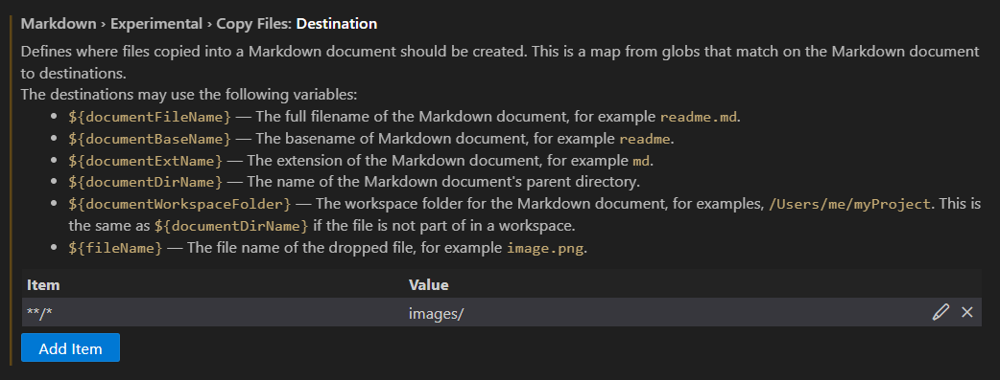

+++
title = "Some tips for using VS code for python development"
date = "2023-04-10"
author= "Robert"
cover = ""
description = "A small (but growing) list of useful tips when developing python in VS code."
mathjax = false
draft = false
+++


# Useful Shortcuts

## Moving lines up/down

shortcut: `alt + up-arrow/down-arrow`

## Add cursors to the end of lines of selected code

shortcut: `alt + shift + i`

## Add cursor directly up or down

shortcut: `ctrl + alt + up-arrow/down-arrow`


# Useful packages

## Error Lens
Adds a nice inline description when something is wrong with your code.

## Black formatter
Adds black as one of the code formatters in VS Code. A nice tip: turn on the setting `format on save`.

## Code Spell Checker
A neat plug-in that checks the spelling of words in comments and doc-strings, but also checks the spelling of variable names.

## GitLens
Adds git-blame annotation, shows authors above each class definition and much more git goodness. 

## Rainbow CSV
A cool plug-in that highlights different columns in a `.csv` file. 

## Rewrap
Wrapping comments, docstrings and text to 90 character width by just pressing `alt+Q`. Ideal when working with ruff and/or black.

## Ruff
The official Ruff plugin for VS-Code. Ruff is a collection of python linters that works extremely fast. 

## GitLab Workflow
When reviewing other's open merge requests, this plugin lets you explore the merge request from within VS code in a much nicer way than the web browser editor on gitlab.com. It allows you to read the description and comments as well. Placing comments is a bit of a hassle, as it doesn't support "reviews" where you can submit all comments at once. It also doesn't support code suggestions. 

## Grammarly
Spell and grammar checker for `.md` and `.txt` files. To check `.md` files, you will have to add the following to your Visual Studio Code settings:

```json
    "grammarly.files.include": [
        "**/*.txt",
        "**/*.md"
    ],
```

or via the interface:


# Other

## Useful settings

### Copy-paste images into markdown files

Add these two lines to your Visual Studio Code settings

```json
    "editor.experimental.pasteActions.enabled": true,
    "markdown.experimental.copyFiles.destination": {
        "**/*": "images/"
    },
```

or via the interface:


and



This allows you to paste an image directly into a markdown file with `ctrl+v / cmd+v`. This inserts the line

```rst

```

into your document and creates a copy of the image in `images/image.png`, where `images` is the name of the folder relative to your file. This can be changed in the settings above. If you include multiple images, each image name will be appended by a number, i.e. `image-1.png`, `image-2.png`, etc.

## Editable installs
Sometimes VS Code has problems with auto-completion and finding the definitions of imported symbols when they come from a package that is installed in editable mode, e.g. via `pip install -e .`. With recent versions of `setuptools` (>=0.64.0), editable installs behave a bit differently and these cause issues. There are three solutions to this:

1. Downgrade `setuptools` (i.e. `pip install setuptools<0.64`)
2. Instruct pip to use a legacy mode: `pip install -e . --config-settings editable_mode=compat`. The developers at `setuptools` do [warn](https://setuptools.pypa.io/en/latest/userguide/development_mode.html#legacy-behavior) however that this is only a temporary solution and will likely to be changed and later removed entirely in future versions of `setuptools`. 
3. Add the project to the python path. When testing out new features inside a jupyter notebook it is sufficient to add the line `sys.path.insert(1, "path-to-package")` in the top cell. `"path-to-package"` can be either an absolute path (e.g. `"/users/rsoko/dev/my-package"`) or a relative path (`"my-package"`, `"./my-package"` or even `"../my-package"`). 

