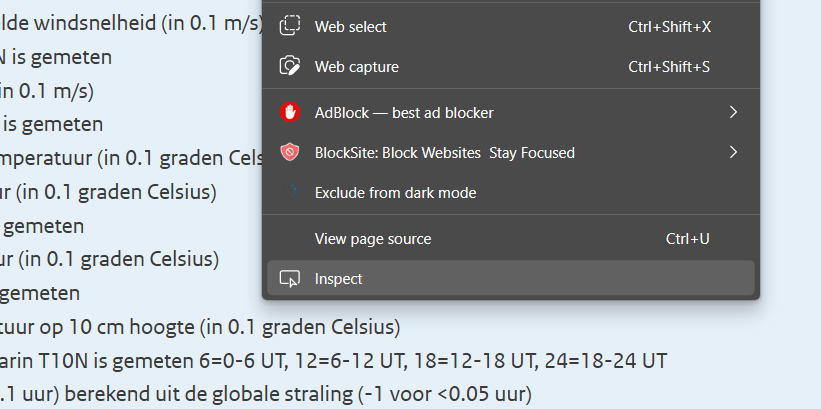
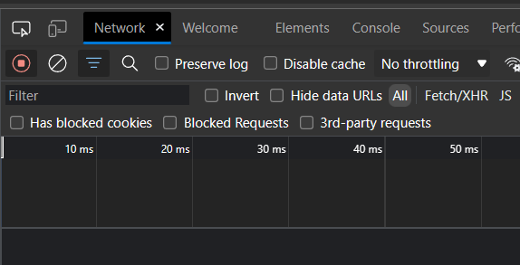
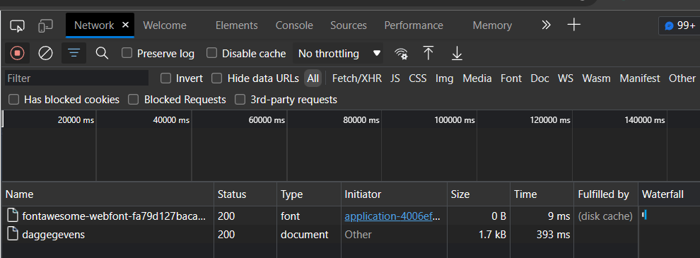
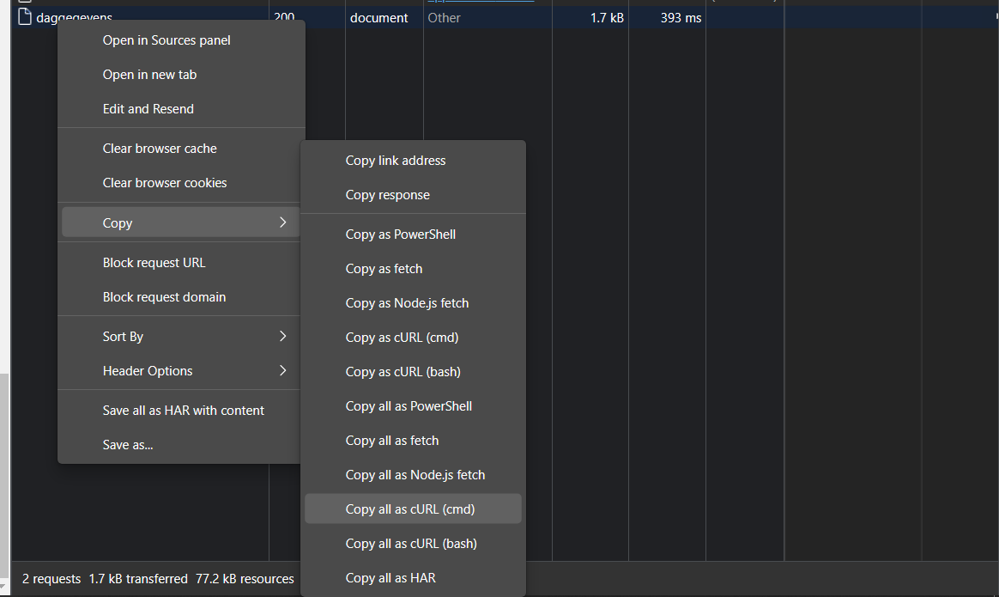
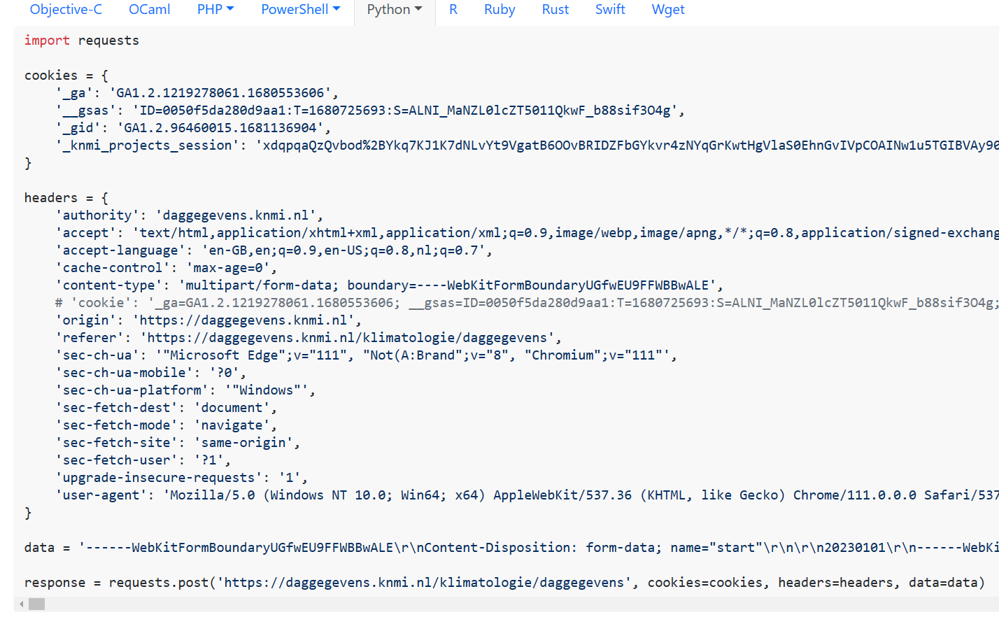

+++
title = "Easy data-scraping using REST API and request package"
date = "2023-04-10"
author = "Robert"
description = ""
+++

Often when webpages provide a friendly interface to download data, the data itself is fetched using a REST API. Most web browsers can easily intercept the request, which you can modify and edit. This is convenient if you want to use Python to download a lot of data, or if you want to set up an automated data download pipeline.

Here's a quick step-by-step guide on how to do so.

## Step 1: Inspect the Web Page
Open your web browser and navigate to the website from which you want to download data. For this example, I use [weather data](https://daggegevens.knmi.nl/klimatologie/daggegevens) from the Dutch Royal Weather Institute (KNMI). 
Right-click on the web page and select "Inspect" or "Inspect Element" from the context menu. This will open the browser's developer tools.



In the developer tools, go to the "Network" tab. This tab allows you to monitor the network activity of the web page, including the REST API requests and responses. 



## Step 2: Identify the REST API Endpoint

Interact with the web page to trigger the REST API request that fetches the data you want to download. In the KNMI data example, we can enter:

- Period: 20230101 - 20230410
- Fields: TG (daily mean temperature)
- Weather stations: 260 de Bilt

and press "Bestand downloaden". Most webpages should have either a similar download button or a search query. 

In the "Network" tab, you should see a list of network requests made by the web page. Look for the REST API request that corresponds to the data you want to download. The REST API request will usually have a URL, method (e.g., GET, POST), and request/response headers. In this example, we look at "daggegevens".




## Step 3: Download the REST API Request as cURL

Right-click the REST API request that you want to download and select "Copy" > "Copy all as cURL" from the context menu. This will copy the cURL command that represents the REST API request to your clipboard.



Open a text editor or a terminal window, and paste the copied cURL command.
Modify the cURL command as needed, such as replacing placeholders with actual values. For example, you may need to update query parameters, request headers, or authentication tokens.
Once you have configured the cURL command, you can execute it in your terminal to download the data from the REST API endpoint. The downloaded data will typically be saved as a response body in the format specified by the REST API (e.g., JSON, XML, CSV).

## Step 4: Write a Python script for automated download

Instead of manually modifying the cURL command and running it from the terminal, it is convenient to do this in Python. This will allow us to automatically sweep through parameters and download everything that we need.

We first convert the cURL request that is sitting in our clipboard, to a Python script that will use the requests package. A convenient webpage is [curlconverter.com/python/](https://curlconverter.com/python/). 



You should have a script that is similar to

```python
import requests

cookies = {
    ...
}

headers = {
    ...
}

data = '...'

response = requests.post('...', cookies=cookies, headers=headers, data=data)
```

In the example of the KNMI weather data, a single download is limited to about 2 years of data. If we want to build a dataset that contains full historical data, we can loop over all the years that we are interested in, where we iteratively run `requests.post(...)` but for the correct years and append it to a larger Pandas `DataFrame`. Inside the large data string we find `name="start"\r\n\r\n20230101\r\n` and `name="end"\r\n\r\n20230410\r\n`, so we insert variables here over which we can loop:

```python
data = f'... name="start"\r\n\r\n{year}0101\r\n ... name="end"\r\n\r\n{year+2}1231\r\n ...'
```

and the looping script will look as:

```python
import pandas as pd
from tqdm import tqdm
from io import BytesIO

def get_data(year):
    data = f'... name="start"\r\n\r\n{year}0101\r\n ... name="end"\r\n\r\n{year+2}1231\r\n ...'
    return data

def get_chunked_df(year):
    data = get_data(year)

    response = requests.post(
        "https://daggegevens.knmi.nl/klimatologie/daggegevens",
        cookies=cookies,
        headers=headers,
        data=data,
    )

    if response.status_code == 200:
        content = response.content
        return pd.read_csv(BytesIO(content), skiprows=60)
    else:
        return None


for year in tqdm(range(1900, 2022, 2)):
    df_chunk = get_chunked_df(year)
    df = pd.concat([df, df_chunk])

df.to_csv("data/weather.csv", index=False)
```

some notes about this code:

- an HTTP request always returns a `status_code`. `200` means you made a successful request and any other code indicates that something went wrong (e.g. `403` - access denied).
- `response.content` returns a *byte stream* that contains the content of the `.csv` file that we requested. This can be passed directly to `pandas.read_csv` using `io.BytesIO`, so no need to save the file to disk first.
- we pass the argument `skiprows=60` to `.read_csv(...)` because the KNMI data contains 60 rows of comments with explanations of what each data field means. The actual data that we are interested in starts from line `61`. 

That's it! We have now successfully downloaded data from a website using REST API by inspecting the web page, identifying the REST API endpoint, and downloading the REST API request as cURL. Remember to always review and follow the terms of use and policies of the website and REST API you are accessing, and be respectful of any usage limits or restrictions. Frequent and bulky downloads are not always appreciated and you might get a temporary IP ban if you overuse the API endpoint. 